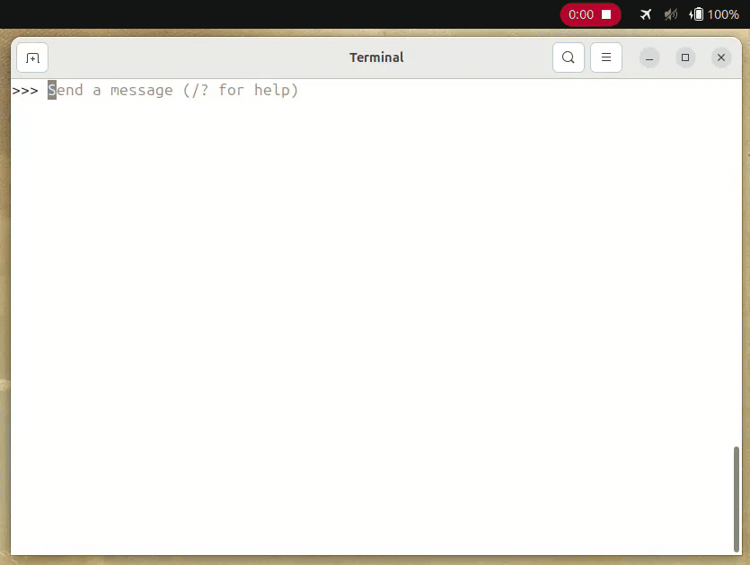

I've been lurking in r/LocalLLaMA for a long time. The idea of running a "ChatGPT" locally has intrigued me ever since I first heard about it. Today I finally tried it, and it was easier than I expected.  
  
To get started, I didn't look for related YouTube videos or blog posts, which has been a common approach for me, and I believe for many, when learning something cutting-edge. Instead of endlessly filtering through useless AI influencer videos and SEO spam for a nugget of good content, I just asked Claude to write me a tutorial as a single markdown file. I've been using this approach lately to great effect, and it didn't disappoint this time either. The tutorial was split into levels of rising complexity. The "first level" was basically just two commands:  
  
1. Install Ollama:  
```bash  
curl -fsSL https://ollama.com/install.sh | sh  
```  
  
2. Download and run a model:  
```bash  
ollama run llama3.1:8b
```  
  
The model was about 4GB, and after the download completed I could start prompting right away. No account, no API key, no internet needed once it's downloaded.  
On my RTX 3060 Mobile (6GB VRAM) the responses were snappy and the laptop didn't get hot.  

My impression was that it's pretty much like the typical LLMs I'm used to using.  
Only when I started asking about some newer CSS features did I realize it can be quite stupid, as its knowledge is capped at December 2023 - so not much use for coding. But no problem, it was meant as a proof of concept and not as a daily coding assistant.  
  
Here's a clip from of my very first prompt:  

