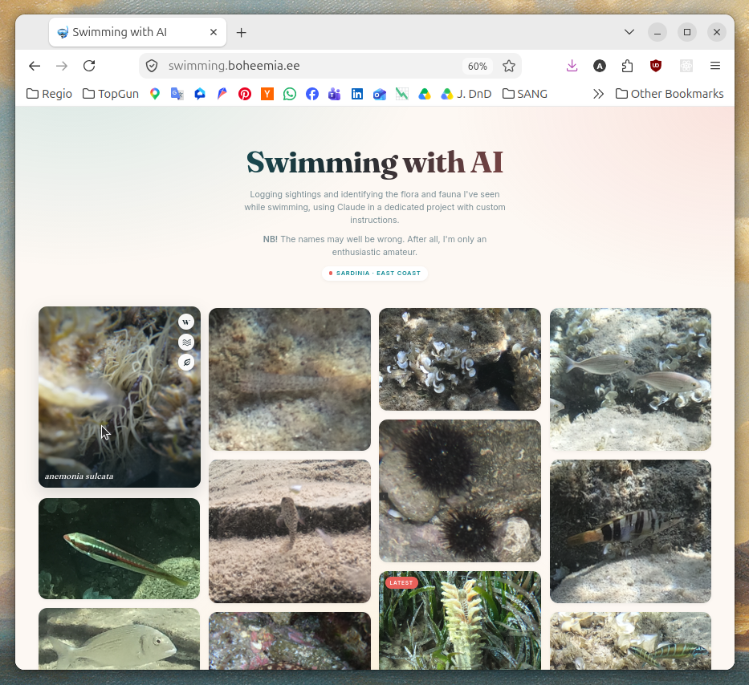

I love swimming, and snorkeling in particular.
It's one of the main reasons I leave my home country every winter for Southern Europe.
One place where swimming is especially rewarding is Sardinia in Italy.
I visited the island some years ago, immediately fell in love with the local nature and vowed to return one day.
This year I had the pleasure of going back and once again enjoying the pristine beaches and crystal-clear water along the island's coast.

The underwater environment there is incredible.
The beaches range from fine sand to gravel and smooth stones, and the seabed is just as varied: sandy patches give way to pebbles, boulders, crevices and steep underwater cliffs.
All of this supports a diverse range of marine flora and fauna.
Seeing so many unfamiliar fish and plants, I naturally felt the urge to identify at least some of them, if not all.

At first I simply tried to remember what I saw.
But back at the computer I quickly realized that I couldn't recall the details well enough to identify anything.
Even if I managed to find a species that looked roughly like what I had seen, I couldn't be sure.
Many fish species look quite similar.
The only reliable way to tell them apart is to have a clear picture of the subject and check the exact color of its head, the shape of its fins and the patterns on its body.

Fortunately, I remembered that at the bottom of my electronics bag was an old GoPro Hero 7, which had sat idle for years and happened to be waterproof.
I found a piece of old cord at my campsite and made myself a bracelet for attaching the camera to my wrist.
This way it wouldn't get lost while diving, and I wouldn't need to hold on to it the whole time while swimming.
Of course, there is specialized gear for using a GoPro underwater and keeping it from sinking, but why spend a lot of money on something I don't even know I need?
A piece of cord was perfectly fine for the time being.
With this setup I hit the beach and managed to shoot a lot of photos underwater.

Back at the campsite I saw that many of the pictures were blurry or unclear, some that I knew I had taken were missing, and some had turned out to be videos.
The last two problems annoyed me a lot.
I would select the right mode at the surface, but while diving I would often discover, to my frustration, that the camera had switched to time-lapse mode on its own, navigated into the settings menu, or simply ignored my button presses.
I wish there were a way to lock the touchscreen, as this ruined a lot of shots.
As for the blurry pictures, I had expected an action camera to be really good at capturing moving subjects, but the low quality might simply be down to the camera being quite an old model.

With the pictures I had, I still faced the problem of how to identify the fish.
I'm not a marine biologist or an ichthyologist, so I had no clue how to go about it properly.
First I tried Wikipedia, as it generally has great information about marine life.
But, well, you kind of need to know what to search for.
And if I knew what to search for, I wouldn't need to identify the species in the first place, so it's not much use for casual identification.

I've also tried to find a book on identifying Mediterranean species, but I haven't found a good one yet.
I imagine there must be a nice book out there with all the information I need.
I just need to keep looking.

There are some enthusiast-made webpages for identifying species from a certain area and/or taxon, e.g. crabs from the east coast of the USA.
Interesting, but of limited use to me.

About a year ago I tried using Claude and ChatGPT to identify a dead crab from a beach in Crete, and I was quite unsuccessful at the time.
Even though I attached good-quality pictures taken from several angles and described the animal's important features, they kept recommending the same two species, both quite different from the one I had found.

But when I tried it again this year, the results were different.
I used Claude Opus 5, attached one or more of my underwater pictures, described the behavior of the fish, where I found it and what it looked like, and I think I mostly got the identifications right.
When I checked the Latin names on iNaturalist, WoRMS and Wikipedia, I could confirm that the LLM had identified the fish correctly.

A small but important thing I did to improve the flow and results of my prompts was to create a project within Claude and define:
- The goal of the prompts within this project: to identify marine life.
- Some background information: the diving location and the current season.
- A procedure: when unsure, ask. I might have extra information that could help with identification but that, for one reason or another, I haven't included in the original prompt.

As a result of this simple addition, identification became much faster, more convenient and more enjoyable.

Now I had a growing list of identified marine life, and at first I just renamed the photos with the correct Latin names and kept them in a dedicated directory on my desktop.
Then I thought it would be great to use these pictures to generate a simple webpage/picture gallery to log my "catch".
I figured it would also be an easy way of sharing my hobby with my friends, and I hope it encourages more people to take up snorkeling.
But then this grew into the idea of turning it into personal educational material by attaching to every species a set of related links with additional information.
Having these links readily available from a gallery of identified species makes learning about them much more convenient.

The result is a kind of Pokédex for marine life.
It's a simple page with Pinterest-like tiles created from the photos.
Every tile has auto-generated links to iNaturalist, Wikipedia and WoRMS.
If a link is incorrect, there is a feature to override it (sorry, I haven't verified all of them, but even if a link doesn't work, it's easy to move on from there to the correct article or page).
Photos from the most recent batch get a "latest" tag on their tile, so anyone coming back to the page can see what I have found since their last visit.

Adding a new sighting stayed pleasantly simple.
I drop a photo named with the species' Latin name into the assets directory, run a small script that picks up whatever is new, and push the changes.
A GitHub Action then builds the page and deploys it.
There is no database and no content management system behind it: the filename is the record.

iNaturalist and WoRMS deserve a special mention.
I had heard of the first one, but had never really taken the time to learn what exactly it's about.
It turned out to be a pretty neat platform where nature lovers help each other identify species and do citizen science.
The next step would probably be to figure out how to link my future contributions to this platform with the sightings on my webpage.
WoRMS I had never heard of before.
It was Claude's suggestion to have a look, and I'm happy that I did, as it's pretty good.
It gives a lot of extra information about each species and has a list of links for further research, a nice complement to the other two sources.

The finished page became a great conversation starter at the campsite where I stayed.
Many people recognized the fish I had photographed, but most of them didn't know their names or characteristics.
I never thought I'd be using AI for swimming, but here I am, taking pictures for an LLM to identify fish and plant life for me, learning more about our wonderful nature and sharing it with others.
I think it's a great example of how to use AI for personal education.

[You can see the page here](https://swimming.boheemia.ee)

